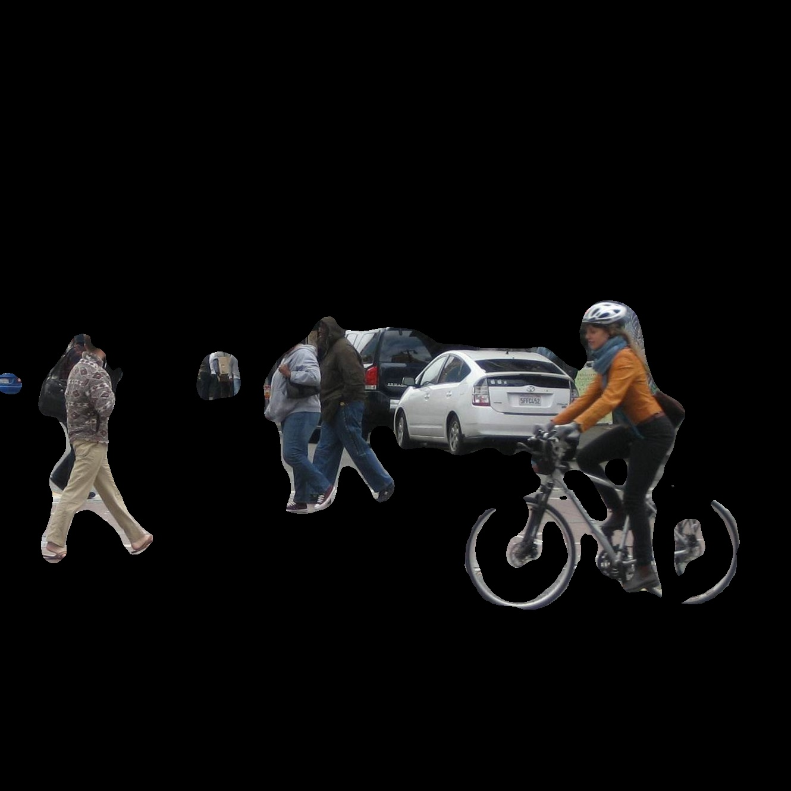

# DeepLab-V3



## Weights
You can download pretrained weights (deeplab_mobilenetv2.pth) from  https://pan.baidu.com/s/1IQ3XYW-yRWQAy7jxCUHq8Q   
and put it into model_data/deeplab_mobilenetv2.pth
code:qqq4

## Train
```
# Start training with: 
python train.py
```

## Predict
If you want to use your own training weights, please modify the self.model_path and self.classes_path in deeplab.py
```
# Detect a single image: 
python predict.py --mode image --input test.jpg
# Detection video: 
python predict.py --mode video --input test.mp4
```
